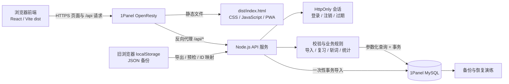

# CET 真题个人背单词系统：项目交接与服务器版开发流程

## 第二批本地后端学习业务（2026-09-19）

本批已在 `server/` 实现设置、到期/拼写队列、学习事件、服务端草稿和新学/复习/独立拼写完成提交；新增 `database/migrations/002_learning_workflow_mysql.sql`。服务端规则集中在 `server/src/learningRules.ts`，完成提交使用受限 `submissionKey`、客户端版本冲突保护和事务语义；前端仍使用 localStorage，未修改 `app/src/App.tsx`、`app/src/data/localStore.ts`、`app/src/data/repository.ts`、`app/src/types.ts`。

本批测试全部使用 fake repository；当前没有 MySQL 测试库，因此没有运行真实 migration/SQL 集成测试，也没有连接生产数据库、SSH 或部署服务器。下一批再做异步前端 repository 接入、真实 MySQL 测试库验证和联调。

更新日期：2026-09-13。本文件是后续开发的主要入口；以本次服务器 + MySQL 路线取代旧 Supabase / Vercel 计划。

## 1. 本次方向与实施边界

用户要求把项目变成部署在自己服务器上的网站，后续连接 1Panel 管理的 MySQL。本次已完成代码和文档复查、架构调整与流程规划；尚未新增后端、连接数据库或部署服务器。

“HTML 格式”的交付定义：保留现有 React + TypeScript 前端源码，构建并交付包含 `index.html`、CSS、JavaScript、图标的完整静态网站目录。无需为服务器部署改写全部页面为手写 HTML。只上传源码根目录的 `index.html` 无法替代构建产物，必须上传完整 `dist/` 内容。该应用运行仍需要浏览器 JavaScript；它不是单个离线 HTML 文件。

Vite 官方说明构建产物可交给静态服务器托管，`vite preview` 仅用于本地预览。1Panel 提供基于 OpenResty 的静态网站和反向代理能力。因此当前前端可以沿用，新工作集中在部署配置、后端接口、身份认证和数据迁移。依据：[Vite 部署说明](https://vite.dev/guide/static-deploy)、[1Panel 网站概述](https://1panel.cn/docs/v2/user_manual/websites/websites/)。

本次规划默认：个人使用优先，先建立个人正式账号，暂不开放公众注册；使用独立域名或子域名根路径。后端暂定 Node.js + TypeScript，以复用现有语言与规则；具体框架、驱动和版本在实施时确定。

## 2. 当前代码状态与保留功能

实际代码仍是本地浏览器版本：

- `app/src/data/repository.ts` 直接导出同步 `localStore`，不是远程 API；当前类型为 `typeof localStore`。
- 登录仅创建本地档案，不验证身份；词库和进度在 localStorage。
- `dist/` 是构建生成的 HTML/CSS/JS 静态产物，部署前需重新构建；已补充 `project/deploy/1panel/` 静态站点和反向代理示例。
- 已有 GitHub Actions 测试及构建配置；本地检查通过不等于远程 CI 已运行。
- 现有 `project/archive/supabase/` 是未执行的 PostgreSQL / Supabase 草案，包含 `auth.uid()`、RLS 和 PostgreSQL 语法，不能导入 MySQL。
- 本地有已暂存、未暂存与未跟踪文件，尚不能只提交现有暂存区。提交前应重新检查全部差异。

继续保留以下已实现的产品行为：

1. 雾蓝主色、暖黄重点提示；中文与手机优先界面。
2. 统一含音标的 8 列 TSV：`word / phonetic / meaning / phrase / sentence / sentence_cn / source / type`；批量预览、手动添加、GPT 拍照识别提示词及两个示例。
3. 同词合并非空内容、marked 优先，重新导入不重置学习进度。
4. 每日新词目标、每日组数（1—20 组）和每组词数（1—20 个，默认 10 个）设置，到期旧词优先，单组最多 20 个词。
5. 新学、复习、拼写已拆成独立入口：新学先完整展示词卡，完成后只安排到明天复习；复习只处理已学且到期的词，执行主动回忆 → 自检 → 错词队尾回炉 → 拼写订正；首页独立拼写只抽今天刚完成新学的词，词库浮栏拼写则严格按当前状态筛选逐组纯练习，拼错后隐藏答案再试，拼对后进入下一词。
6. 认词和拼写分数分别记录，保留本轮曾犯错的信息；独立拼写不推进复习层级、不伪造认词结果，固定 stage 调度暂时保留。
7. 主动斩词、即时撤销、重新恢复；斩词与系统自动判定已掌握分开。
8. 学习草稿按 `new`、`review`、`spell` 入口隔离，包含队列、当前位置、首次选择、输入与核对结果；音标/释义编辑保留进度。
9. 本地 JSON 导出、恢复前自动备份、损坏存储保护和写入锁。
10. 顶部主题设置支持跟随系统、日间、夜间；偏好保存在当前设备，不写入词库数据。
11. 个人页集中展示新词、记忆中、巩固中、已掌握、已斩五个层次，并用柱状图显示数量。
12. 个人页支持本机“倒数日”：任意名称和目标日期会按本地日历日自动计算；首页只显示日期与精简倒数提示，不额外堆叠数据卡片。

## 3. 目标架构与配置归属

请求链路：

```text
手机 / 电脑浏览器
    ↓ HTTPS
1Panel 管理的 OpenResty（同一域名）
    ├─ /、静态资源 → 完整 dist/ 网站目录
    └─ /api/*     → Node.js 后端服务
                       ↓ 私有网络连接
                    1Panel 管理的 MySQL
```

| 部分 | 负责什么 | 部署与配置 |
| --- | --- | --- |
| 前端静态包 | 页面、输入、学习交互、API 请求 | 1Panel 静态站点目录；默认保留现有 `#/words` 等 hash 路由 |
| OpenResty | HTTPS、静态资源、API 转发 | 静态站点增加 `/api/` 代理；API 错误不能回退成 HTML |
| Node.js API | 登录、用户隔离、校验、调度、事务、备份迁移 | 独立后端服务，由 1Panel 运行环境或容器编排管理 |
| MySQL | 正式账号、词库、进度、设置、复习历史 | 使用应用专属数据库与账号 |
| localStorage | 旧版本保留、明确的本地演示模式 | 服务器版不能在请求失败时偷偷回退写本机数据 |

前端默认请求相对地址 `/api`，不包含数据库账号或密码。数据库 host、port、name、user、password 只在后端环境配置中保存；任何 `VITE_*` 变量都不用于数据库凭据。实施时先完善后端环境变量示例及忽略规则，再写入实际值。

1Panel 是管理入口，应用直接连接其管理的 MySQL 服务，不通过面板 API 读写词库。官方说明应用商店数据库采用容器部署，连接地址随运行位置而不同：[1Panel MySQL 文档](https://1panel.cn/docs/v2/user_manual/databases/mysql/)。

部署前检查 API、MySQL、OpenResty 所在的实际容器网络。容器里的 `127.0.0.1` 只指向该容器，不能直接当成另外一个服务的地址。优先使用共同私有网络及服务名称；默认不向公网开放 3306 或 API 内部端口。应用账号仅访问本项目数据库，迁移建表权限与日常读写权限分开。

### 数据库对接图文预览



这条链路中，浏览器永远不直接连接 MySQL。浏览器只访问同域的 `/api`；OpenResty 把请求转给 Node.js，Node.js 从 HttpOnly 会话取得当前用户，再执行用户归属检查、输入校验和事务。数据库地址、账号和密码只存在后端环境文件，静态 `dist/` 中不会出现这些值。

实施顺序是：先生成静态 `dist/` 并部署页面；然后把当前同步的 `repository` 改成异步 API 适配器；接着建立 Node.js 服务、MySQL migration、登录和词库接口；最后导出旧浏览器 JSON，做预检和冲突预览，再事务导入正式账号。导入核对、双设备复习、备份恢复和 HTTPS 验收通过后，才切换日常使用。

## 4. 新项目流程与验收节点

| 阶段 | 工作与交付物 | 完成标准 | 是否依赖服务器 |
| --- | --- | --- | --- |
| 0：路线重规划 | 更新本交接、README，停用旧 Supabase 接入指引 | 文档无相互矛盾的下一步 | 已在本轮完成 |
| 1：静态网站交付 | 整理生产构建、生成完整静态包、补部署说明；处理缓存与资源路径 | 生产静态预览中页面/刷新/资源正常；包内无凭据；旧词库导出可实际落盘 | 本地准备不依赖；可先部署本机存储试用版 |
| 2：异步前端接口 | 独立定义 repository 契约；本地适配器与 HTTP 适配器；页面 loading/error/retry | 本地适配器维持原功能，模拟延迟/断网/401 时无假保存、重复提交或空白页 | 不依赖，可使用测试 API |
| 3：API + MySQL | 建后端、版本化 MySQL migration、认证、词库与设置接口、复习事务及草稿 | 在真实 MySQL 测试实例验证增删改查、用户隔离、失败回滚、幂等重试 | 需要可运行的 MySQL 测试实例，可本地容器 |
| 4：旧数据迁移与联调 | 导入预检、旧 ID 映射、学习记录迁移、导入结果核对 | 原词义/音标/进度/斩词状态保留，重复上传不重复建词，导入失败不产生半份数据 | 需要后端和测试数据库 |
| 5：1Panel 预发布 | 部署静态包/API、内网数据库连接、HTTPS、启动检查、备份与恢复演练 | 浏览器端完整流程及跨设备持久化通过，重启后仍可用 | 需要服务器环境与域名配置 |
| 6：正式使用 | 发布记录、版本切换、回退方案、监测和备份计划 | 从另一台设备登录可恢复进度，恢复演练通过，已知限制明确 | 需要生产环境 |

顺序：先把阶段 1 的可上传静态包准备好，再做阶段 2–4，最后进入服务器预发布和正式切换。若先上线阶段 1，页面必须明确“数据仍在当前浏览器”，不能标成已经云同步。

## 5. 后端与前端改造清单（尚未实现）

### 5.1 异步数据层

保持 `app/src/data/repository.ts` 为入口，但不能只把导出对象换成网络对象。当前页面同步读取登录、列表、到期任务并立即处理返回值；这些调用必须改为异步状态管理。

规划新增：

- 独立 Promise 接口、HTTP 适配器、本地兼容适配器；将认证、词库数据与本机损坏恢复工具分开。
- 请求中的按钮状态、会话过期处理、明确保存成功/失败和可重试反馈。
- 用户切换后取消旧请求或忽略旧响应，避免上一档案结果写入当前页面。
- 抽取可测试的导入校验和调度规则，服务端再次校验所有输入。
- 正式账号的数据以 API 为准；MVP 网络中断时保留待提交的本轮内容并提示重试，不自动进行离线写入和双向合并。
- 草稿按 revision 处理多设备冲突；过期页面不能覆盖较新的队列或输入。每日新词目标或组数修改对新队列生效，现有草稿保持队列，除非词已删除/斩掉。

### 5.2 认证与接口范围

个人版本默认关闭开放注册，通过后端初始化命令建立首个账号。密码使用可靠密码哈希；采用同源 HttpOnly、Secure、SameSite 会话 cookie，服务端保存可失效会话，并处理 CSRF / Origin 校验、登录限流和注销失效。账号恢复先采用服务器端重置流程，后续再增加邮件功能。

以下是待实现的接口契约，不是现有端点：

| 接口组 | 计划接口与职责 |
| --- | --- |
| 会话 | `POST /api/auth/login`、`POST /api/auth/logout`、`GET /api/auth/me` |
| 词库 | `GET /api/words`（分页/筛选）、`POST /api/words/import`、`PATCH /api/words/:id`、`DELETE /api/words/:id` |
| 斩词 | kill / undo-kill / restore 三种明确操作；按版本检查，避免撤销覆盖别的修改 |
| 学习 | 获取今日任务、创建本轮 session、保存/获取/放弃草稿、提交本轮结果 |
| 设置与统计 | 每日目标、组数、每组词数、时区、倒数日和今日统计；按记录区分首次作答与订正 |
| 迁移与备份 | 当前账号导出、备份预检、导入迁移；替换恢复单独确认与事务执行 |
| 运维 | 健康/就绪检查，不返回数据库密码、堆栈或内部敏感配置 |

所有数据查询和写入从服务端会话取得 user_id，不能信任浏览器传来的用户 ID。删除、导出、草稿、统计、批量接口同样检查归属。数据库使用参数化查询和受限字段更新。

复习提交以服务端 session_id + 唯一提交键保证幂等：同一提交重试返回原结果，不再增加分数。服务端验证本轮词和答案、读取当前进度版本、计算新分数与日期，再用事务一起写入进度、历史和 session 完成状态；其他设备旧版本提交返回冲突并提示重新载入。客户端不能直接指定最终 stage 或下次日期。

### 5.3 MySQL 数据规划

使用独立 MySQL migration，不能修改 Supabase SQL 的后缀后直接执行。引擎采用 InnoDB，文本采用 utf8mb4；选定实际 MySQL 版本后测试约束、索引、JSON 与时间行为。数据库 UTC 存储，日任务按用户时区计算，默认 Asia/Shanghai。

| 表 | 核心用途和约束 |
| --- | --- |
| users | 稳定服务端 ID、规范化邮箱唯一、密码哈希、创建时间；与本地邮箱生成 ID 分离 |
| auth_sessions | 会话摘要、账号、过期/撤销时间；会话材料不放前端 localStorage |
| words | user_id、8 列词汇内容、创建/更新时间；`(user_id, normalized_word)` 唯一 |
| word_progress | stage、两项分数、到期、first_learned_at、最近结果、killed_at、last_restored_at、version；每用户每词唯一 |
| user_settings | 每日新词目标、每日组数、每组词数、时区、倒数日名称和目标日期；user_id 唯一 |
| review_sessions | 本轮词列表/版本、草稿和 revision、完成状态、唯一提交键与结果 |
| review_logs | 每轮每词一条，保存首次反应、尝试次数、曾拼错、前后阶段及完成时间；不因重试重复记录 |
| import_batches | 迁移批次/内容指纹/旧 ID 映射及结果，用于重试去重和核对 |

补充 user/word 的关联完整性、分数和阶段范围、词形长度及必填校验。现有旧词可能缺 IPA：新词与普通导入仍要求音标；旧备份预检列出缺失项，用户补齐后入正式库，不擅自生成音标。替换恢复不能清除其他账号，也不能绕过学习历史与引用关系的完整性规则。

## 6. 本地词库迁移规则

域名、协议、端口变化都会改变浏览器存储来源；`127.0.0.1`、`localhost` 和服务器域名不能自动共享当前词库。登录新的正式账号也不会自动带走旧档案。

迁移流程：

1. 在实际有数据的旧地址打开词库，完成或明确放弃本轮学习，再导出 JSON，并确认文件真实落盘。
2. 当前导出主要包含 words + progress，不包含未完成草稿、每日目标和完整历史。记录每日目标，先完成旧草稿；未来如扩展备份格式，增加版本及兼容读取。
3. 在服务端正式账号下上传预检：核对词数、必填音标、重复词、日期、分数、斩词数量；旧 email userId 不作为正式身份凭证。
4. 服务端生成 ID，映射 word/progress 关系，保留可用 firstLearnedAt、阶段、分数、到期时间与斩词状态。旧数据未保存的完整历史不能反推伪造。
5. 首次导入默认面向空词库；目标已有数据时先提供冲突预览，选择明确的合并或替换规则。不可静默覆盖服务器进度。
6. 导入前保存服务端备份，导入事务成功后核对结果；用户再次上传同批数据不能重复建词或重复增加历史。
7. 确认另一台设备能读取同一结果后再切换日常使用。旧浏览器原数据和导出文件保留到迁移验收完成。

## 7. 服务器部署与发布要求

阶段 1 产物至少包括：完整静态目录/压缩包、构建版本与校验值、1Panel 静态站点操作说明。阶段 5 增加后端构建/容器文件、MySQL migrations、服务端环境配置示例、代理配置、备份恢复及回退说明；这些后端文件目前尚未创建。

- 在本地或 CI 构建；生产静态站点不运行 Vite dev / preview。
- 首版使用域名根路径；如果未来放入子路径，需一起修改 Vite base、manifest、service worker 注册与资源地址。仅改一个 HTML 路径不足。
- 保留现有 hash 路由即可部署；`/api/*` 必须进入 API，静态资源不存在应正确报错，不能返回登录页 HTML 冒充接口结果。
- 上线前调整 `app/public/sw.js`：目前会缓存同源 GET；必须排除 API、登录、备份下载等个人数据。处理缓存版本、旧资源清理、更新提示和离线边界。
- `index.html` 与 `sw.js` 应可及时重新验证；带哈希资源可长期缓存。发布时处理旧标签页资源兼容与 service worker 的版本切换。
- 前后端代码发布先在预发布验证；保留上一版本可回退。数据库 migration 单独记录版本，优先兼容新增结构；不能把静态包回退当作数据库回退。
- MySQL 做定期备份并保留异机副本，先在测试库演练恢复；站点静态包备份不等于词库备份。检查重启自启、连接池、日志轮转、磁盘空间和证书续期。
- 后端密钥位于静态网站根目录外；实施时把实际后端环境文件加入忽略规则。服务日志不打印密码、cookie 或完整个人备份。

## 8. 验证记录和上线前待测

历史记录（2026-09-10，不代表本轮重新执行）：

- 数据层测试 11/11、TypeScript 检查、Vite 构建及 diff 空白检查通过。
- 独立 localhost 浏览器冒烟通过：登录、含音标导入、错词回炉、拼写重试隐藏答案、刷新恢复输入、完成统计、编辑音标/释义。
- 备份按钮出现成功提示，但未确认原生下载文件落盘；恢复文件流程、PWA、真实多标签竞争尚未完整验收。
- 代码复查确认：支持 Web Locks 时使用锁，不支持时回退保存；旧文档“缺少 Web Locks 一律保存失败”已过时。同页锁和旧快照检查不等于所有本地写入均有事务。

本轮（2026-09-13）：复查源码、现有构建目录和文档，核对 Vite / 1Panel 官方部署说明；修正 Service Worker 不应缓存 `/api` 的问题，更新环境变量模板，补充 `deploy/1panel/` 部署说明和反向代理示例。随后补充首页每日组数、每组词数设置、localStorage 保存、总任务上限和草稿恢复保护；每日组数使用带“完成天数”的两列滚轮，每组词数使用单列滚轮，完成天数按“每日组数 × 每组词数”计算。本轮新增顶部主题菜单（跟随系统/日间/夜间）、深色主题样式覆盖和主题偏好测试，并修复深色模式快捷卡片白底浅字导致的低对比度问题；新增个人页，用柱状图集中展示五个记忆层次并从首页移除原五项指标。完成 14 项本地数据测试、TypeScript 检查、Vite 构建和 diff 空白检查。未连接服务器/MySQL，也未声称服务器版已验收；实际手机/桌面多视口截图仍需在浏览器中复验。

服务器版上线必须新增：

1. 生产静态预览、手机布局、刷新路由、资源缓存与离线更新。
2. 备份实际下载 → 文件恢复 → 条目与进度比对；损坏文件、超过大小上限、配额失败。
3. 真实 MySQL 下的约束、事务失败回滚、服务重启后持久化和数据库恢复演练。
4. 至少两个测试账号互相尝试查询/编辑/删除/导出/提交对方词汇，验证 API 归属检查。
5. 双设备同一轮提交、断网后重试、连点完成、过期会话、草稿冲突、删除或斩词后继续旧草稿。
6. 时区午夜、每日新词目标与组数跨轮扣减、固定调度不变、旧备份时间和 IPA 的迁移校验。
7. API 响应不被 service worker 或代理缓存；退出账号后不出现前一账号数据。
8. 真实服务器 HTTPS 下“登录 → 导入 → 复习 → 刷新 → 另一设备登录”完整链路。

## 9. 代码导航和旧方案处理

| 文件 | 当前职责 / 下一步 |
| --- | --- |
| `app/src/App.tsx` | 当前页面和同步调用；阶段 2 改异步并拆分模块 |
| `app/src/data/localStore.ts` | 本地规则与备份；保留作为迁移兼容参考 |
| `app/src/data/repository.ts` | 当前同步统一入口；后续独立定义远程接口契约 |
| `app/src/types.ts` | 当前数据结构；后续补服务端 DTO 和版本字段 |
| `app/tests/storage.test.mjs` | 本地数据测试；后端与端到端测试另行新增 |
| `app/public/sw.js`、`app/src/main.tsx` | 缓存与注册；已排除 `/api` 缓存，接真实 API 前仍需完成浏览器验收 |
| `project/archive/supabase/` | 停用的历史方案，不执行其中 SQL |
| `.env.example` | 前端 API 和后端环境变量占位；当前未读取，真实数据库值只放后端 |
| `.github/workflows/ci.yml` | 已有本地数据测试与构建任务；后续补 MySQL/API/浏览器测试 |
| `project/deploy/1panel/` | 静态站点上传、发布检查和 `/api/` 反向代理示例 |

本地已有配置可运行：

```bash
pnpm install --frozen-lockfile
pnpm test
pnpm build
pnpm preview
```

当前 CI 设定 Node.js 24 和 pnpm 11；实施前核对实际工具版本及 lockfile。preview 仅用于本地验收。

## 10. 下一次直接接手

优先执行阶段 1 和阶段 2。尚无服务器连接信息也可以继续静态包、缓存整改和异步接口准备。

部署前需核对：服务器系统/架构、1Panel 版本、站点域名与 HTTPS、MySQL 实际版本及运行位置、可用 Node.js 运行方式、站点目录和容器网络。数据库凭据届时配置到服务器后端环境中，不写进交接文档。

可直接使用以下指令：

> 阅读交接文档.md 和当前 git diff，按 2026-09-13 的“服务器 + 1Panel + MySQL”路线推进。先完成阶段 1 的完整静态 HTML/CSS/JS 交付包、缓存整改与部署说明，再改异步 repository 并保留本地模式回归。保留现有词库和未提交文件，不执行 project/archive/supabase/ 的 SQL。阶段 3 新建独立后端与 MySQL migration，阶段 4 迁移旧档案；每阶段按验收标准验证并更新交接。服务器参数缺失时继续完成不依赖它们的开发。

## 11. Emil UI 优化交接（2026-09-13）

本轮只修改展示层、交互层和架构预览页，没有修改 `app/src/data/localStore.ts`、`app/src/data/repository.ts`、`app/src/types.ts`、TSV 解析列定义、复习评分/调度规则或 JSON 备份结构。现有 localStorage key、旧档案、复习草稿、8 列 TSV 和备份文件继续兼容。

### 11.1 用户可感知的变化

| Before | After | Why |
| --- | --- | --- |
| 页面切换后浏览器标题不变，键盘用户缺少快速入口 | 每个路由更新页面标题；增加“跳到主要内容”；切换路由后焦点进入主内容；底部导航标记当前页 | 明确信息层级，减少键盘重复导航，帮助读屏软件理解当前位置 |
| 多处按钮使用宽泛的 Tailwind `transition` 与触屏也会触发的 hover | 所有动画明确列出 `transform`、`opacity`、颜色、边框或阴影；hover 仅在 `(hover: hover) and (pointer: fine)` 生效 | 避免意外属性动画和触屏粘滞悬停，反馈更稳定 |
| 弹窗只有 Esc 关闭，焦点可以跑到背景，关闭后焦点位置丢失 | 弹窗锁定页面滚动、圈定 Tab/Shift+Tab、支持 Esc 和点击遮罩关闭，并把焦点还给原触发按钮 | 桌面键盘、读屏和移动端操作均更可预期 |
| 主题菜单、导入页签、头像和组数滚轮主要依赖鼠标/触控 | 主题菜单支持上下/Home/End；页签支持左右/Home/End；头像支持方向键；滚轮支持上下/PageUp/PageDown/Home/End | 核心设置无需鼠标也能完成 |
| 部分图标、筛选项和文字按钮触控区域不足 44px | 主题、筛选、文件操作、词库动作、发音与架构控制统一到至少 44px | 降低手机误触，保持紧凑但可点 |
| 长词库每次输入都同步过滤并绘制全部卡片 | 搜索输入使用 `useDeferredValue`；结果使用 `useMemo`；离屏词卡使用 `content-visibility: auto` | 大词库输入更顺滑，减少离屏布局和绘制 |
| 后台标签页每分钟仍刷新 React 状态 | 定时同步仅在页面可见时执行；focus、pageshow、storage 和重新可见时仍会同步 | 降低后台耗电，不改变跨标签页数据刷新语义 |
| 架构页持续播放连线动画，并把项目文档原文打入发布包 | 连线只在主动播放请求时动画；源码扫描白名单化，不再打包 README、交接文档等无关文本 | 减少持续绘制、包体和不必要的信息暴露 |
| 不减少动态效果的系统仍看到全部动画 | `prefers-reduced-motion: reduce` 下关闭位移、弹窗/菜单过渡、架构脉冲和连线动画 | 尊重系统辅助功能设置 |

### 11.2 已修改文件和具体位置

`app/src/App.tsx`：

1. `PageShell` 增加主内容焦点引用、路由标题、跳过导航按钮和底部导航 `aria-current`；图标标记为装饰内容。
2. `ThemeMenu` 增加 trigger 引用、菜单 ID、打开后的当前项聚焦、方向键循环、Home/End 和 Esc 焦点归还。
3. 用 `useModalDialog` 替代只处理 Esc 的旧 hook。该 hook统一完成 body 滚动锁、初始焦点、焦点圈定、Esc 关闭、遮罩点击和关闭后焦点恢复。
4. 账号、每日组数、每组词数、斩词确认四个弹窗接入统一 hook，并补充 `aria-labelledby`、`aria-describedby` 和可聚焦面板。
5. 两个滚轮增加 listbox 键盘操作和 `aria-activedescendant`；方向键、PageUp/PageDown、Home/End 使用即时定位，触控/鼠标仍可平滑滚动，系统减少动态效果时统一禁用平滑滚动。
6. 头像选择改成可用方向键的 radiogroup；导入方式改成带完整 ID/控制关系和左右键操作的 tablist。
7. 词库页补充隐藏主标题、搜索 label、筛选 `aria-pressed`、词卡 `aria-expanded/aria-controls` 和状态提示语义。
8. 词库筛选使用延后关键词与记忆化结果，个人页五种状态只遍历一次词库；各种文字按钮和自定义按钮补充 `type="button"` 与 44px 触控高度。
9. 复习页保留原算法，只调整按钮语义、反馈类名、发音触控尺寸和弹窗接入；进度条与统计柱取消不必要的尺寸动画。

`app/src/styles/index.css`：

1. 删除组件 `@apply` 中的通用 `transition` 和 `hover:*`，改为列出具体过渡属性和 140—220ms 时长。
2. 按钮按下采用 `scale(0.97)` 或 `scale(0.98)`，没有 `scale(0)`；弹窗从 `translateY(12px) scale(0.97)` 进入，菜单从触发器方向进入。
3. 所有悬停样式放进精确指针媒体查询；减少动态效果时关闭位移、过渡和循环动画。
4. 增加 skip link、触控优化、滚轮焦点环、长列表 content visibility 及统一按钮反馈类。
5. 架构页控制按钮增大到 44px，删除重复 transition 声明，并把节点与控制按钮 hover 限定为鼠标设备。

`app/src/pages/ArchitecturePage.tsx`：

1. `import.meta.glob` 从扫描整个项目改为源码/测试/必要配置白名单，避免把文档和部署说明打进前端产物。
2. 连线动画只在请求演示的当前步骤启用；用户新建的连线默认静止。
3. 播放期间禁用重复触发并设置 `aria-busy`；重置视图在减少动态效果模式下使用 0ms。

### 11.3 本轮验证结果

使用项目锁定依赖和本机可用的 Node 运行时执行：

```bash
node ./node_modules/typescript/bin/tsc --noEmit
node --test app/tests/*.test.mjs
node ./node_modules/typescript/bin/tsc -b
node ./node_modules/vite/bin/vite.js build
git diff --check
```

结果：TypeScript 无报错；数据测试 14/14 通过；生产构建通过；差异空白检查通过。静态扫描没有发现 `transition: all`、Tailwind `hover:`、`scale(0)` 或 `scale-0`。首页 JavaScript 为 316.86 kB（gzip 95.69 kB），架构页独立 JavaScript 为 387.80 kB（gzip 110.39 kB）；收紧扫描前架构页 gzip 为 146.20 kB，本轮减少约 35.81 kB。构建仍把架构图作为独立延迟加载 chunk，因此首页不会先下载 `@xyflow/react`。

### 11.4 本轮尚未验证的浏览器行为

以下项目不能仅凭 TypeScript、Node 数据测试和 Vite 构建宣称通过：

1. iPhone Safari、Android Chrome 真机上的安全区、软键盘、滚轮惯性、触控命中和弹窗高度。
2. Safari、Chrome、Firefox 的实际 Tab 顺序，以及 VoiceOver/NVDA 对 dialog、menu、tablist、radiogroup 和 listbox 的朗读。
3. `@starting-style` 在旧版浏览器中是否显示进入动画；不支持时应无动画但仍可用。
4. 数千词真实数据下 `content-visibility` 的滚动收益及 Safari 回退表现。
5. 系统“减少动态效果”打开后的完整视觉验收，以及架构图拖拽、缩放和触控板手势。
6. 原生文件选择、JSON 实际下载落盘、备份恢复结果比对、PWA 离线/更新和多标签页 Web Locks 竞争。

### 11.5 续作验证（2026-09-13）

按交接文档先启动本地 loopback 预览并在右侧浏览器栏打开首页。随后用浏览器自动化完成一轮不写入词库的交互验收：

1. 首页“修改每日组数”弹窗可打开；组数 listbox 用 `ArrowDown` 后立即选中下一项，未产生键盘平滑滚动；`Escape` 关闭后焦点回到“修改每日组数”按钮。
2. “修改每组词数”弹窗同样支持键盘即时选择，右侧今日上限跟随“每日组数 × 每组词数”更新；`Escape` 关闭正常。
3. 主题菜单可通过按钮打开，菜单项具有 `menuitemradio` 和当前选中状态；`Escape` 关闭后焦点回到主题按钮。
4. 个人页可从底部导航进入；账号设置弹窗具有 dialog 标识、头像 radiogroup、用户名/邮箱控件，打开后焦点进入弹窗，`Escape` 关闭后焦点回到账号设置按钮。

本次为本机 Chromium 右侧预览的桌面冒烟，不等同于 Safari/Firefox、真机触控、读屏或多视口验收；这些边界仍按 11.4 和第 12 节保留。

### 11.6 UI 续作（2026-09-13）

根据上一轮提出的“信息层级和按钮反馈”方向，继续做了三处展示层调整：

1. 首页学习计划右上角的两个图标按钮保留原有可访问名称，同时增加“每日组数”“每组词数”短标签；桌面宽度显示图标和文字，窄屏自动收起文字但保留 `aria-label`、`title` 和 44px 触控命中区。
2. 首页进度数字从紧凑的 `2/10词` 改为 `2 / 10 词`，启用等宽数字，并给 progressbar 增加 `aria-valuetext`，视觉和读屏都能明确当前进度。
3. 复习路由继续使用底部“今日”入口，`/review` 时“今日”导航获得 `aria-current="page"` 和选中样式，减少进入复习后失去位置感的问题。

本轮右侧 Chromium 预览复验：首页设置按钮标签可见；复习页“今日”导航 `aria-current` 为 `page`；首页、词库、导入、个人页面均能正常加载。未触碰 repository、localStorage、TSV、备份和复习评分逻辑。

### 11.7 今日页增强（2026-09-13）

在不新增数据字段、不改变复习算法的前提下，首页新增三块已有状态的组合展示：

1. “今天的安排”摘要：使用现有 `dueWords` 拆出到期复习和新词数量，并显示当前待学习总数。
2. “今日目标”进度：使用现有每日组数 × 每组词数作为目标，按已有 `lastReviewAt` 的今日完成数量显示进度条和 `aria-valuetext`；完成数按目标上限显示，避免进度超过 100%。
3. “继续上次学习”卡片：当现有 review draft 有效时，显示当前阶段、词序位置和继续入口；没有草稿时不渲染，不占用首页空间。

样式使用独立的 `home-daily-*` / `home-resume-*` 类，浅色和深色主题分别提供对比度；移动端摘要保持三列，继续学习按钮在窄屏变为整行按钮。右侧本机 Chromium 已看到新增区域，首页、复习入口和数据测试均正常。

### 11.8 今日页组件编辑（已移除，2026-09-13）

此前尝试过首页组件排序和长按拖动，现已按产品取舍全部移除。今日页恢复为固定顺序的学习计划、今日安排、继续学习和词库掌握度组件，不再显示“编辑布局”、上下箭头、拖动提示或布局工具栏；原有单词、学习计划、复习算法和其他 localStorage 数据不受影响。

### 11.9 学习计划卡片视觉收紧（2026-09-13）

1. 移除了学习计划卡片右下角的半圆装饰，并将卡片背景改为不透出页面底层径向色块的实色渐变，避免深色模式出现突兀的弧形色块。
2. “拼写 / 新学 / 复习”三个入口降低高度、内边距和文字尺寸；桌面端约 69.6 CSS px 高，移动端约 62.4 CSS px 高，仍保留足够触控区域。
3. 保持原有路由、每日组数、每组词数、进度计算和复习入口逻辑不变；右侧 Chromium 已验证伪元素装饰已移除及按钮尺寸收紧。

### 11.10 新学与复习组数分开计算（2026-09-13）

1. 首页不再用每日总组数作为新学和复习两个入口的共同分母。
2. 今日分子分别取当前待处理队列中的新词数、到期复习词数，再除以每组词数向上取整；新学分母固定使用每日组数设置，复习分母使用整个词库中非斩词已学词的总组数。底层待处理列表也分开限额：新词按每日计划截取，复习到期词不被新词计划截断。
3. 例如词库有 8 个新词、2 个复习词，每组 1 个且每日上限 5 组时，显示“新学 3/5 组、复习 2/2 组”；每组改为 2 个时，显示“新学 4/5 组、复习 1/1 组”。每日总上限仍由 `getDueWords` 控制，不改变复习评分或存储格式。
4. 右侧 Chromium 已验证上述两种每组词数切换结果，测试结束后恢复为每组 1 个。

### 11.11 新词不足计划与复习页返回（2026-09-13）

1. 当词库中新词数量少于“每日组数 × 每组词数”时，首页学习计划显示提示，说明会按实际可用数量完成；不补入复习词，也不虚构单词。比如仅剩 8 个新词、计划 3 组且每组 20 个时，实际按 8 个完成，入口仍显示新学 `1/3 组`。
2. 复习/拼写页面的准备、主动回忆、错词回炉、拼写验证和完成状态均增加“返回今日”按钮。返回使用首页路由，不清除已保存的复习草稿；再次进入复习页时可继续上次进度。

### 11.12 参考百词斩五十音页面后的背词与计划增强（2026-09-13）

1. 手机镜像观察到的可借鉴结构：学习计划卡展示词库名称、已学/总词数和进度；“新学”“复习”是两个独立入口；计划调整页用滚轮选择每日组数，并实时联动完成天数、预计完成日期和预计用时；词库按词本展示数量；任务页把复习组数、学习得分和连续答对拆成独立任务。
2. 首页“新学”和“复习”现在进入不同路由（`#/review/new`、`#/review/review`），新学只取今日待学新词，复习只取今日到期的已学词；原有 `#/review` 仍保留给草稿恢复和兼容入口。
   旧版本没有 `mode` 字段的草稿仍可从兼容入口恢复；新学/复习专用入口不会把旧的混合草稿带入当前队列。
3. 每日组数 × 每组词数成为已配置计划下的新词日上限；到期复习词单独排队，不受新词日上限截断。旧的 `cet-word-mvp-target:*` 仍作为未配置新计划时的兼容回退，不删除旧 localStorage 数据。新增测试覆盖“计划设置优先、旧目标回退”和“复习不被新词计划截断”。
4. 词库页增加词库总览卡，展示总词数、新词、记忆中、已掌握和待复习数量；原搜索、状态筛选、音标编辑、斩词、恢复和 JSON 备份流程保持不变。
5. 复习准备页、主动回忆、拼写验证会标明当前是“新学”还是“复习”，减少混队误解。完成 16 项本地数据测试、TypeScript 检查、Vite 生产构建和 diff 空白检查；手机镜像只做了页面观察与未保存的滚轮联动测试，没有保存百词斩计划或进行购买操作。

### 11.13 词库释义遮罩（2026-09-13）

1. 参考百词斩“单词列表”页，词库列表默认不直接显示中文释义；每个词条的遮罩按钮可单独显示该词释义。
2. “显示释义 / 隐藏释义”总开关放在搜索与筛选区上方的固定工具条中：第一次点击显示全部释义，第二次点击全部收起，并清除单独展开状态。
3. 遮罩使用真正的 button、`aria-label` 和 `aria-pressed`，支持键盘操作；隐藏时中文文本不进入可访问树，搜索仍然可以匹配释义。
4. 视觉变化只使用明确的颜色、边框和 opacity/指定属性 transition，悬停样式限制在精确指针设备，并支持 `prefers-reduced-motion`。
5. 浏览器已验证：默认 10 个词全部有遮罩、单词可单独显示、全部显示/全部关闭可往返；未改变 localStorage、TSV、备份格式或学习进度。

### 11.14 词库紧凑列表（2026-09-13）

1. 词条折叠态改为三列扫描布局：最左侧是 5 格纵向记忆进度，中间是单词与音标，右侧是中文释义或可点击遮罩。每格对应一个记忆进度位置；详细分数、下次复习日期、来源和操作只在展开词条后显示，避免列表被重复信息撑高。
2. 保留“全部 / 今日 / 未学习 / 学习中 / 已熟识 / 已斩”六个筛选项。其中“学习中”合并内部 `learning` 与 `review` 阶段；“今日”仍按当前到期任务集合筛选，不修改调度算法。
3. “显示释义”工具条使用 `position: sticky`，滚动到词条区域后固定在顶部导航下方。窄屏仍保持“单词在左、释义在右”的两列关系，最小 320px 宽度不需要横向滚动；每个主要触控入口维持约 44px 高度。
4. 深色主题为未点亮进度格、已点亮进度格、展开箭头、详情分隔线和按压/悬停状态提供单独颜色，避免浅色闪烁；没有新增高频动画，现有反馈只使用指定属性 transition，`prefers-reduced-motion` 仍会关闭过渡。
5. 本轮验证：TypeScript 检查通过；本地数据测试 16/16 通过；Vite 生产构建通过；`git diff --check` 与 motion 扫描通过。右侧 Chromium 验证了单词释义可显示后再次遮住、总开关的全部显示/关闭、未学习与学习中筛选，以及滚动后固定工具条（顶部约 74 CSS px）。

### 11.15 新学、复习与独立拼写拆分（2026-09-13）

1. `#/review/new` 现在是纯新学流程：只取尚未学习的新词，逐词完整展示单词、音标、发音、词性释义、搭配和例句；不再先进行主动回忆或拼写。完成本组时调用 `completeNewStudy`，仅设置 `firstLearnedAt`、`lastReviewAt` 和明天的 `nextReviewAt`，不填写认词/拼写结果，也不改变任何分数或复习层级。
2. `#/review/review` 只处理已学习且到期的词，继续使用主动回忆、错词回炉和复习末尾的拼写验证。`#/review` 仅保留给旧版混合草稿的兼容恢复；旧草稿不会进入新的专用入口。草稿现在支持 `mode: "spell"` 与 `phase: "learning"`，并按新学、复习、拼写分开恢复。
3. 首页“拼写”改到 `#/spell`：只取本地日期等于今天的 `firstLearnedAt`，也就是今天刚完成新学的词；以前学过、今天只做复习或尚未新学的词不会进入。最多取当前“每组词数”（仍硬限制 20）；今天新学词不足组上限时，界面明确显示按实际数量练习。
4. 独立拼写完成只由 `finishSpellingPractice` 记录拼写分数和错拼信号；不会推进 `reviewStage`、改变认词分数或伪造复习成绩。错拼会把下次到期日提前到不晚于明天，但仍不改变复习层级。完成写入、新学写入与复习写入都改为单调递增 `updatedAt`，防止同一毫秒连续提交绕过旧快照保护。
5. 含音标 TSV 不新增列，仍保持 8 列和旧备份兼容；`meaning` 现要求新导入内容写成“词性 + 中文释义”，例如“v. 分配；拨出”。GPT 图片识别提示词、两个正确示例、手动输入标签和校验提示已同步更新。旧词不会自动猜词性，需下次同名单词重新导入时补齐。
6. 深色模式释义悬停不再复用浅色的浅蓝底：遮罩与总开关使用深蓝底浅字，已经显示的释义悬停仅改变边框和文字为高对比浅色，日间模式原有视觉保持不变；所有悬停样式仍受精确指针媒体查询和减少动态效果设置约束。
7. 验证：TypeScript 检查、18/18 本地数据测试和 Vite 生产构建均已通过；右侧 Chromium 已打开新学页和拼写准备页，确认分别显示“先认识新词，再安排复习”和“只拼今天新学的词”，且每组不足时按实际数量显示。真实桌面浏览器的深色释义悬停像素级对比度、连续完成一整组后第二天到期以及新/旧草稿跨刷新恢复，仍应在下一轮浏览器验收中复测。

### 11.16 词库范围拼写浮栏（2026-09-14）

1. 词库页底部导航上方新增单一“拼写”悬浮操作栏。它显示当前状态筛选和该筛选内的词数；例如“全部 · 10 个词”“今日 · 10 个词”“未学习 · 8 个词”。搜索框只用于检索展示，不会意外缩小练习范围。
2. 点击浮栏进入 `#/spell?scope=library&filter=<当前筛选>`。`all / today / new / learning / mastered / killed` 六种筛选均可进入；“学习中”沿用词库页定义，合并内部 `learning` 和 `review` 阶段；“今日”沿用当前到期任务集合。哈希 query 变化会触发页面重新读取范围。
3. 词库范围拼写按当前“每组词数”逐组截取，仍有全局单组最多 20 个词的保护。完成一组后，如果该筛选还有词，会出现“继续第 N 组 X 个词”；最后一组才回到词库。每日首页的 `#/spell` 不带 query，仍只拼当天刚完成新学的词，规则没有被放宽。
4. 词库范围拼写是纯练习：不会写入 `firstLearnedAt`、`lastReviewAt`、`reviewStage`、认词/拼写分数或下次复习时间，因此从“未学习”或“已斩”筛选进来练习也不会错误改变学习状态。页面在开始和完成时都明确说明该边界。
5. 学习草稿新增可选 `scope: "daily" | "library"`，旧草稿缺失该字段时仍按每日拼写兼容。当前只有一个草稿存储槽：从词库真正开始拼写会覆盖先前正在进行的每日拼写草稿；仅打开词库范围准备页再返回不会覆盖草稿。若未来要并行保留多种未完成拼写，需要按 scope 拆分草稿键名并做迁移。
6. 新增浮栏为固定定位，不遮挡底部导航；浅色/深色主题均有高对比颜色、键盘焦点环、按压反馈。hover 只在精确指针设备启用，减少动态效果时移除浮栏按钮过渡与缩放。
7. 验证：TypeScript 无报错；本地数据测试 18/18 通过（包含 `scope: "library"` 草稿往返）；Vite 生产构建与 `git diff --check` 通过；motion 扫描未找到 `transition: all` 或 `scale(0)`。右侧 Chromium 已验证“全部 · 10 个词”浮栏进入全部范围准备页，以及“未学习 · 8 个词”浮栏进入 `filter=new` 的范围准备页；控制台没有 error/warning。尚未在真实多组词（例如每组 3 个、共 8 个）上完成整组并点“继续下一组”的端到端浏览器验收。

### 11.17 首页继续学习卡片移除（2026-09-14）

1. 首页组件从“学习计划 / 今日安排 / 继续学习 / 词库掌握度”收紧为“学习计划 / 今日安排 / 词库掌握度”，不再单独显示“继续上次学习”“已保存”或词序进度卡。
2. 草稿没有删除：点击首页“新学”进入 `#/review/new` 时，仍会恢复 `mode: "new"` 的新学草稿；点击“复习”进入 `#/review/review` 时，仍会恢复 `mode: "review"` 的复习草稿；拼写入口继续自行恢复 `mode: "spell"` 的拼写草稿。
3. 为避免旧版本没有 `mode` 的混合复习草稿失去入口，`#/review/review` 现在也会恢复这类草稿；恢复并再次保存后，会按当前复习模式写入。没有改动 TSV、备份、localStorage 键名、排程或评分规则。
4. 已清除无渲染用途的 `home-resume-*` 样式；首页删除组件不使用额外动画，保留其余按钮的既有触控反馈和深色模式样式。

### 11.18 词库整理、首页收紧与倒数日（2026-09-14）

1. 首页删除“今天的安排”和“词库掌握度”两张大卡，只保留欢迎语、当天日期和学习计划卡。存在词库时学习计划卡会占用可用的主要纵向空间；不新增轮播、动效或第二套统计，页面保持单一学习入口。
2. 欢迎语下方固定显示本地格式日期；设置倒数日后在同一行显示“距离六级考试还有 X 天”一类的精简文本。计算以用户设备当天零点和目标日的日历差为准：当天显示“就在今天”，过去日期明确显示已过天数，避免时区或夏令时导致的半天误差。
3. 个人页新增“倒数日”设置卡和弹窗，名称可写六级、雅思、考研或任意目标，最多 32 个字符，日期必须是真实日历日期。数据按本机档案存到独立键 `cet-word-mvp-countdown-v1:<userId>`，不修改词库、复习算法、8 列 TSV 或 JSON 备份格式。因为当前 JSON 备份仍只覆盖 words/progress，换设备时需要重新设置倒数日；服务器阶段应迁移到 `user_settings`。
4. 词库页新增“词库整理”。“导出 TSV”导出全词库（不受当前搜索或筛选影响）的可编辑 8 列文件：`word / phonetic / meaning / phrase / sentence / sentence_cn / source / type`。导出会把单元格内 Tab 与换行压成空格，保证可以直接交给现有行式 TSV 导入器。改音标时优先直接重新导入同名单词，原学习进度会保留；JSON 备份仍用于完整的 words/progress 恢复。
5. “批量删除”进入管理态后可逐项选择，或针对当前状态筛选 / 搜索结果全选；确认弹窗说明词条和进度会永久删除、不能从“已斩”恢复，并提示先导出 JSON 备份。`localStore.deleteWords` 一次写入删除当前档案命中的 words 与 progress，重复 ID 或其他档案 ID 不会越权删除。
6. 本轮验证：TypeScript 无报错；`node --test tests/storage.test.mjs` 为 21/21 通过（新增可编辑 TSV 列格式、批量删除隔离和倒数日隔离/日期校验）；Vite 生产构建和 `git diff --check` 通过。右侧 Chromium 已确认首页不再渲染两张卡、个人页倒数日入口/弹窗及 Esc 关闭、词库“导出 TSV / 批量删除”入口。为避免动到用户现有示例词库，尚未在浏览器中确认删除操作，也未检查原生 TSV 下载实际落盘。

## 12. 下一轮详细操作步骤

### 第一步：做真实浏览器和多视口验收

1. 先运行生产预览，不使用开发服务器作为最终依据：执行 `pnpm build`，再执行 `pnpm preview --host 127.0.0.1 --port 4173`。
2. 桌面端分别检查 1440×900、1024×768；移动端检查 390×844、375×667 和 320px 最窄宽度。
3. 每个尺寸依次打开今日、复习、导入、词库、个人；检查横向溢出、底部导航遮挡、键盘弹出后的输入框位置和弹窗可滚动区域。
4. 只用键盘完成：切换主题、切换导入页签、选择头像、修改两个滚轮、展开词卡、开始复习、提交拼写和取消斩词。
5. 每个弹窗验证：打开后焦点在弹窗内；Tab 不进入背景；Esc 和遮罩关闭；关闭后焦点回到原按钮；滚轮用方向键后保存值正确。
6. 打开系统“减少动态效果”，确认无按钮位移、弹窗位移、主题菜单位移、架构脉冲和动态连线；功能仍可操作。
7. 记录浏览器、系统、视口和失败步骤；只修复可复现问题，不修改数据协议。

### 第二步：补自动化无障碍与浏览器测试

1. 先引入 Playwright 与 axe 测试依赖，并把浏览器安装/缓存放进 CI；不要把测试依赖加入生产 dependencies。
2. 新建页面对象或辅助函数，使用独立测试邮箱和清理后的 localStorage，避免污染真实档案。
3. 增加最小路径：本地登录 → 导入 8 列 TSV → 首页任务 → 主动回忆错词回炉 → 拼错后隐藏答案 → 拼对完成。
4. 增加交互断言：主题菜单箭头键、tablist 左右键、四个弹窗焦点圈定、两个滚轮方向键、词卡 aria-expanded、44px 触控区域。
5. 增加 axe 扫描，但保留人工 VoiceOver 测试；自动扫描不能代替读屏操作验证。
6. CI 先跑数据单测和 TypeScript，再构建并启动 preview，最后跑 Chromium；Safari/WebKit 和移动视口可在稳定后加入。

### 第三步：继续降低首屏维护成本和包体

1. 先用构建报告记录首页主 chunk、CSS 和架构 chunk 大小，作为基线。
2. 把 `App.tsx` 按 PageShell、Home、Review、Import、Words、Profile、dialogs 拆成模块，但保持 repository 调用顺序和 props 契约不变。
3. 只对低频页面做 `React.lazy`：优先 Import、Words、Profile；Review 可预取，避免用户点击开始学习后等待。
4. 把 `parseTsv` 抽到独立纯函数模块并沿用现有测试样例；不得改 8 列顺序、重复合并、marked 优先或必填校验。
5. 每拆一个页面就运行 14 项数据测试、TypeScript 和生产构建，并用浏览器复验该路由；不要一次性重写全部页面。

### 第四步：接服务器 API 前保持双适配器边界

1. 先为现有同步 localStore 写一个不改行为的本地适配器，再定义 Promise 形式的 repository 接口。
2. 页面增加 loading、error、retry 和防重复提交状态；不得在远程失败时静默回写 localStorage。
3. HTTP 适配器只请求同域 `/api`，cookie 使用 HttpOnly 会话；MySQL 凭据只存在服务端。
4. 用模拟延迟、401、500、超时和重复响应测试页面，再接 Node API 与 MySQL。
5. 每完成一个接口组，重复执行第 6、8 节的迁移与验收步骤，并更新本交接文档的已完成/未验证边界。

## 12. 数据库接入第一批（2026-09-19）

执行依据：`project/docs/数据库接入执行手册.md`。本批只做本地代码，不碰服务器与真实数据。

### 12.1 新增内容

- `server/`：Node.js + TypeScript + Fastify 垂直切片，含 `app.ts` 工厂、`main.ts` 启动入口、配置校验、mysql2 连接池/事务、argon2 密码与会话、zod 校验、MySQL repository、内存测试替身、health/auth/words 路由。
- `database/migrations/001_initial_mysql.sql` + `database/README.md`：MySQL 8（InnoDB/utf8mb4/DATETIME(3) UTC）表结构与约束。
- `server/scripts/migrate.ts`（执行迁移）与 `server/scripts/create-user.ts`（一次性建首个账号，不开放公开注册）。
- `server/tests/*.test.ts`：48 项测试，全部注入内存替身，无 MySQL 也能运行。
- 根 `package.json` 脚本（`test:server` / `typecheck:server` / `db:migrate` / `user:create` / `server:dev`）、`.env.example` 后端占位符、`pnpm-workspace.yaml`（argon2 构建白名单）。

### 12.2 实际运行过的验证

| 命令 | 结果 |
| --- | --- |
| `corepack pnpm run test:server` | 48 通过 / 0 失败 |
| `corepack pnpm run typecheck:server` | 通过（tsc 7.0.2，`server/tsconfig.json`） |
| `corepack pnpm test`（前端既有） | 22 通过 / 0 失败 |
| `corepack pnpm run build` | 构建成功（vite 8.3.0） |

### 12.3 本批明确未做

- 前端未接入 API：`app/src/data/localStore.ts`、`app/src/data/repository.ts`、`app/src/App.tsx` 未改动，TSV/复习算法/备份格式不变。
- 未运行任何 MySQL 集成测试：没有可用的测试库，迁移 DDL、SQL、索引与约束尚未在真实 MySQL 8 上验证。
- 未安装/启动生产 MySQL，未接入生产库，未迁移真实用户数据，未改 1Panel / OpenResty / DNS / 证书。
- `review_drafts` 与三类复习完成提交已在第二批实现；`review_sessions` / `review_logs` / `import_batches` 仍保留到后续批次，未伪造实现。

### 12.4 需要复核的已知副作用

- 为安装后端依赖执行了 `corepack pnpm install`。由于 `package.json` 中部分依赖声明为 `latest`，pnpm 重新解析了 dist-tag：react/react-dom 19.2.8→19.3.0、vite 8.2.2→8.3.0、@types/react(-dom) 同步升级。升级后前端 22 项测试与生产构建仍全部通过，但这是本批预料之外的锁文件变动。
- pnpm 12 默认阻止依赖构建脚本，argon2 已加入 `pnpm-workspace.yaml` 的 `onlyBuiltDependencies`；argon2 自带 darwin-arm64 预编译绑定，`hash`/`verify` 已实测可用，未降级密码哈希。

### 12.5 下一批建议

1. 取得独立测试库后先跑 `db:migrate` 并补 MySQL 集成测试（唯一约束、复合外键、级联删除、分页 SQL）。
2. 再为复习提交写接口与测试，落 `learning_events` 写入路径，然后才谈统计趋势上云。
3. 前端切异步 repository 时按第 5 节边界：HTTP 适配器只请求同源 `/api`，失败不回写 localStorage。
4. 决定是否把 `package.json` 的 `latest` 声明收敛为明确版本，避免以后每次装依赖都产生无关升级。
